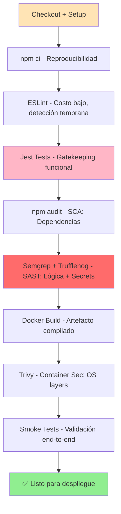

# DevSecOps Pipeline - Justificación Técnica

**Documento de Justificación del Diseño de Pipeline CI/CD con Enfoque DevSecOps**

---

## 📋 Tabla de Contenidos

1. [Introducción](#introducción)
2. [Etapas del Pipeline](#etapas-del-pipeline)
3. [Herramientas por Fase DevSecOps](#herramientas-por-fase-devsecops)
4. [Análisis de Riesgos Mitigados](#análisis-de-riesgos-mitigados)
5. [Flujo de Decisiones](#flujo-de-decisiones)

---

## Introducción

Este documento justifica técnicamente cada decisión tomada en el diseño e implementación del pipeline CI/CD DevSecOps para el proyecto de arquitectura de microservicios (Frontend/Backend).

### Principios Rectores
- **Shift-Left Security**: Integrar seguridad desde las primeras etapas del desarrollo
- **Automatización Total**: Eliminar fallos manuales mediante automatización
- **Trazabilidad Completa**: Documentar cada decisión y resultado del pipeline
- **Defensa en Profundidad**: Múltiples capas de validación antes del despliegue

---

## Etapas del Pipeline

### **ETAPA 1: SETUP & DEPENDENCY VALIDATION** ⚙️

#### Herramienta: `npm ci` (Continuous Integration)
```yaml
npm ci --verbose
```

**¿Qué hace?**
- Instala dependencias exactas especificadas en `package-lock.json`
- Garantiza builds 100% reproducibles
- Falla si el lock file no coincide con package.json

**¿Por qué es necesaria?**
- **npm install**: Puede instalar versiones menores/patch actualizadas (no determinista)
- **npm ci**: Exactamente las versiones especificadas (determinista)
- Previene el síndrome "funciona en mi máquina"

**Riesgos mitigados:**
- Regresiones por incompatibilidad de versiones no testadas
- Ataques de typosquatting en versiones actualizadas automáticamente

**Justificación técnica:**
> En CI/CD es crítico que todos los builds sean idénticos. Si el Developer A tiene express 4.17.1 y el Developer B tiene 4.17.3, el pipeline debe rechazar esto.

---

### **ETAPA 2: CODE QUALITY ANALYSIS** 🔍

#### Herramienta: ESLint
```javascript
npx eslint src/ --max-warnings=0
```

**¿Qué hace?**
- Análisis estático de código JavaScript/JSX
- Detecta:
  - Variables no utilizadas
  - Funciones sin retorno implícitamente undefined
  - Uso incorrecto de async/await
  - Antipatrones de React

**Configuración: --max-warnings=0**
- Convierte advertencias en errores
- Previene deuda técnica acumulada

**¿Por qué es necesaria?**
```javascript
// ❌ ESLint detecta esto:
const users = getUserList();

async function fetchData() {
  const result = await api.get();
  // Falta return!
}

// vs ✅
async function fetchData() {
  return await api.get();
}
```

**Riesgos mitigados:**
- Bugs difíciles de depurar en tiempo de ejecución
- Inconsistencia en estilos de código
- Vulnerabilidades por mal manejo de tipos

**En arquitectura DevSecOps:**
- **Posición**: Antes de compilar/testear
- **Impacto**: Bajo costo, detección temprana
- **Justificación**: La calidad de código es la base del software seguro

---

### **ETAPA 3: AUTOMATED TESTING** 🧪

#### Herramientas: Jest (Unit/Integration Tests)
```bash
npm test -- --coverage
```

**¿Qué hace?**
- Ejecuta pruebas unitarias de backend y frontend
- Genera cobertura de código
- Verifica funcionalidad core de endpoints

**Ejemplo de test en users-service:**
```javascript
describe('POST /auth/login', () => {
  test('should return JWT token on valid credentials', async () => {
    const response = await request(app)
      .post('/api/login')
      .send({ username: 'user@example.com', password: 'secure123' });
    
    expect(response.status).toBe(200);
    expect(response.body).toHaveProperty('token');
  });

  test('should fail on invalid password', async () => {
    const response = await request(app)
      .post('/api/login')
      .send({ username: 'user@example.com', password: 'wrong' });
    
    expect(response.status).toBe(401);
  });
});
```

**¿Por qué es necesaria?**
- Gatekeeping funcional antes de seguridad
- Un test fallido previene regresiones de seguridad
- Verifica que las mitigaciones de seguridad no rompan el flujo

**Riesgos mitigados:**
- Regresiones funcionales
- Lógica de autenticación/autorización rota
- Endpoints expuestos accidentalmente

**En arquitectura DevSecOps:**
- **Posición**: Después de análisis de calidad, antes de seguridad
- **Justificación**: No vale la pena escanear seguridad si el código no funciona

---

### **ETAPA 4: DEPENDENCY SCANNING (SCA)** 📦

#### Herramienta: `npm audit`
```bash
npm audit --audit-level=moderate
```

**¿Qué hace?**
- Escanea dependencias contra base de datos de CVEs (Common Vulnerabilities and Exposures)
- Reporta:
  - Vulnerabilidades conocidas en librerías
  - Severidad (LOW, MODERATE, HIGH, CRITICAL)
  - Versiones que solucionan cada problema

**Ejemplo real:**
```
┌───────────────────────────────────────────────────────────────┐
│ 2 MODERATE vulnerabilities found in 256 dependencies          │
├───────────────────────────────────────────────────────────────┤
│ Packages: lodash                                              │
│ Vulnerability: Prototype Pollution in lodash                  │
│ Fix available via: npm audit fix --force                      │
│ Version affected: < 4.17.21                                   │
└───────────────────────────────────────────────────────────────┘
```

**¿Por qué es necesaria?**
- Las dependencias son vectores de ataque comunes
- CVEs son descubiertos continuamente
- npm audit es el estándar de la industria

**Riesgos mitigados:**
- **Supply Chain Attacks**: Compromisos de librerías populares
- **Known CVEs**: Exploits públicos en versiones viejas
- **Dependency Confusion**: Instalación accidental de paquetes maliciosos

**En arquitectura DevSecOps:**
- **Posición**: Paralelo a tests, antes de SAST
- **Severidad**: Se detiene en MODERATE o superior
- **Justificación**: Una sola librería comprometida = todo el sistema comprometido

**Alternativas consideradas:**
- **Snyk**: Más granular, requiere integración con cuota API
- **Dependabot**: Excelente para monitoreo continuo, pero no suficiente en CI
- **npm audit**: Nivel suficiente, built-in, sin dependencias externas

---

### **ETAPA 5: SAST - STATIC APPLICATION SECURITY TESTING** 🔐

#### Herramienta Primaria: Semgrep
```bash
semgrep --config=auto --severity=ERROR
```

**¿Qué hace?**
Analiza el código **sin ejecutarlo** para detectar:
- Inyección SQL
- Cross-Site Scripting (XSS)
- Hardcoded secrets (API keys, contraseñas)
- Improper Input Validation
- Insecure Deserialization

**Ejemplo de vulnerabilidad detectada:**
```javascript
// ❌ Semgrep detecta:
app.get('/user/:id', (req, res) => {
  // User ID sin validar → Injection vulnerability
  const query = `SELECT * FROM users WHERE id = ${req.params.id}`;
  db.query(query, (err, result) => {
    res.json(result);
  });
});

// ✅ Correcto:
app.get('/user/:id', (req, res) => {
  const userId = parseInt(req.params.id, 10);
  if (isNaN(userId)) return res.status(400).send('Invalid ID');
  
  db.query('SELECT * FROM users WHERE id = ?', [userId], (err, result) => {
    res.json(result);
  });
});
```

#### Herramienta Secundaria: Trufflehog (Secrets Detection)
```bash
trufflesecurity/trufflehog@main
```

**¿Qué hace?**
- Escanea commits para encontrar secrets filtrados
- Detecta:
  - AWS Access Keys
  - GitHub PATs
  - Database credentials
  - Private keys

**¿Por qué es necesaria?**

| Riesgo | Severidad | Justificación |
|--------|-----------|---------------|
| SQL Injection | **CRITICAL** | Acceso completo a DB, robo de datos |
| XSS | **HIGH** | Session hijacking, credential theft |
| Code Injection | **CRITICAL** | Remote Code Execution (RCE) |
| Secrets en Código | **CRITICAL** | Acceso a recursos externos, compromiso de cadena |

**En arquitectura DevSecOps:**
- **Posición**: Después de tests pero ANTES de compilar/desplegar
- **Severidad**: Cualquier ERROR bloquea el pipeline
- **Justificación**: Un bug de seguridad no testado es peor que cero tests

---

### **ETAPA 6: ENVIRONMENT SETUP** 🔧

#### Validación de .env files
```bash
test -f backend/users-service/.env && \
  cp backend/users-service/.env.example backend/users-service/.env
```

**¿Qué hace?**
- Crea archivos .env seguros para CI sin datos sensibles
- Previene que secrets hardcoded lleguen al repositorio
- Valida que la estructura de configuración es correcta

**¿Por qué es necesaria?**
- .env files nunca deben estar en Git
- El pipeline necesita variables de entorno para testear
- En producción se usan secrets gestionados por secretos de GitHub/K8s

**Riesgos mitigados:**
- Secrets expuestos en repositorio público
- Fallos en despliegue por variables faltantes
- Inseguridad por envs hardcoded

---

### **ETAPA 7: DOCKER BUILD & TAGGING** 🐳

#### Estrategia de Tagging
```bash
docker build \
  --tag users-service:${{ github.sha }} \
  --tag users-service:latest \
  --label "org.opencontainers.image.revision=${{ github.sha }}" \
  --label "org.opencontainers.image.created=$(date)"
```

**¿Qué hace?**
- Crea imagen Docker para cada servicio
- Tags inmutables: `users-service:<commit-sha>`
- Tags mutables: `users-service:latest`
- Añade metadatos para trazabilidad

**¿Por qué es necesaria?**
- Reproducibilidad: Cada commit = imagen única e inmutable
- Rastreabilidad: Saber exactamente qué código hay en cada contenedor
- Rollback: Volver a cualquier versión anterior

**Ejemplo de cadena de suministro segura:**
```mermaid
Commit abc123 → Build → users-service:abc123 ✅
               ↓
           Scan (Trivy)
               ↓
           Deploy → Prod
               
Reporte de vulnerabilidad descubierto después:
→ Revert a: users-service:anterior
→ Investigar solo abc123
```

---

### **ETAPA 8: CONTAINER SECURITY SCANNING** 📋

#### Herramienta: Trivy (Aqua Security)
```bash
trivy image users-service:${{ github.sha }} \
  --severity CRITICAL,HIGH \
  --format json
```

**¿Qué hace?**
- Escanea la imagen Docker construida
- Detecta vulnerabilidades en:
  - Layer base (alpine, debian, etc.)
  - Librerías instaladas
  - Binarios del sistema
  
**Ejemplo de salida:**
```json
{
  "Results": [
    {
      "Target": "users-service:abc123",
      "Class": "os-pkgs",
      "Vulnerabilities": [
        {
          "VulnerabilityID": "CVE-2021-3129",
          "Severity": "HIGH",
          "PkgName": "openssl",
          "InstalledVersion": "1.1.1k",
          "FixedVersion": "1.1.1l",
          "Title": "ALPACA: Application Layer Protocol Confusion Attack"
        }
      ]
    }
  ]
}
```

**¿Por qué es necesaria?**

| Diferencia | SAST | Container Scan |
|-----------|------|-----------------|
| **Qué analiza** | Código fuente | Imagen compilada |
| **Detecta** | Lógica insegura | CVEs en librerías OS |
| **Ejemplo** | SQL injection | OpenSSL 1.1.1k vulnerado |

**Riesgos mitigados:**
- Imágenes base con vulnerabilidades conocidas
- Librerías compartidas comprometidas
- Ataques a nivel de SO

**En arquitectura DevSecOps:**
- **Posición**: Última línea de defensa antes del despliegue
- **Severidad**: 
  - CRITICAL → Bloquear siempre
  - HIGH → Bloquear (configurable)
  - MEDIUM/LOW → Advertir, no bloquear

**Alternativas consideradas:**
- **Grype (Anchore)**: Similar, menos popularidad
- **Snyk Container**: Premium, cobertura más amplia
- **Trivy**: OSS, rápido, built-in en GitHub

---

### **ETAPA 9: SMOKE TESTS** 🔥

#### Pruebas de Integración Básicas
```bash
curl http://localhost:3000/health
curl -X POST http://localhost:3001/auth/login \
  -H "Content-Type: application/json" \
  -d '{"username":"test","password":"test"}'
```

**¿Qué hace?**
- Levanta todo el stack con `docker-compose`
- Verifica que servicios responden
- Testea flujos de autenticación básicos

**¿Por qué es necesaria?**
- Última validación de que "el sistema completo funciona"
- Detecta problemas de configuración de red
- Verifica que los cambios de seguridad no rompan el flujo

**Riesgos mitigados:**
- Deployments silentes que rompen endpoints
- Network policies que bloquean comunicación inter-servicios
- Mitigaciones de seguridad mal implementadas

---

## Herramientas por Fase DevSecOps

```
┌─────────────────────────────────────────────────────────────────────┐
│                        DEVSECOPS PHASES                              │
├─────────────────────────────────────────────────────────────────────┤
│                                                                      │
│  ⬤ PLAN                   ⬤ DEVELOP            ⬤ TEST                │
│    - Risk Assessment        - Code Review       - SAST               │
│    - Threat Modeling        - Pair Programming  - DAST               │
│                             - Version Control  - Performance         │
│                                                                      │
│  ⬤ BUILD                  ⬤ DEPLOY            ⬥ MAINTAIN            │
│    - Compile                - Secrets Mgmt      - Logging (out)      │
│    - Unit Tests             - Container Sec     - Monitoring (out)   │
│    - Code Quality           - IaC scanning      - Incident Response  │
│    - Dependency Scan        - Config Review                          │
│    - SAST                                                            │
│                                                                      │
└─────────────────────────────────────────────────────────────────────┘

En este pipeline cubrimos: PLAN → DEVELOP → TEST → BUILD → DEPLOY
```

### Matriz de Decisiones

| Fase | Herramienta | Por qué | Riesgo Mitigado |
|------|------------|---------|-----------------|
| Setup | `npm ci` | Reproducibilidad | Supply chain inconsistency |
| Quality | ESLint | Antipatterns tempranos | Code debt, logical errors |
| Test | Jest | Gatekeeping funcional | Regresiones de seguridad |
| **SCA** | **npm audit** | **Librerías comprometidas** | **Supply chain, CVEs conocidos** |
| **SAST** | **Semgrep** | **Vulnerabilidades lógicas** | **Injection, XSS, Secrets** |
| **SAST** | **Trufflehog** | **Secrets filtrados** | **Credentials en repo** |
| Docker | `docker build` | Trazabilidad | Non-reproducible builds |
| **Container** | **Trivy** | **CVEs en base image** | **Supply chain (OS level)** |
| Integration | Smoke tests | End-to-end validation | Configuration errors |

---

## Análisis de Riesgos Mitigados

### 1️⃣ Supply Chain Attacks (⭐ Prioridad: CRÍTICA)

**Ejemplo real:** `event-stream` npm package hackeado (2018)
- 9M descargas/mes
- Atacante publicó versión con malware
- 1000s de proyectos afectados

**Mitigación en nuestro pipeline:**
```
npm ci → Valida lock file es exacto
    ↓
npm audit → Detecta CVEs en dependencias
    ↓
Trivy → Escanea librerías de OS base
```

**Justificación:** No es suficiente con `npm audit`. Trivy detecta CVEs en capas de base que npm audit no ve.

---

### 2️⃣ Injection Attacks (SQL, Command, etc.) (⭐ Prioridad: CRÍTICA)

**Ejemplo vulnerable:**
```javascript
// ❌ Vulnerable a SQL Injection
app.get('/api/courses/:id', (req, res) => {
  const query = `SELECT * FROM courses WHERE id = ${req.params.id}`;
  db.query(query);
});

// Attack: /api/courses/1 OR 1=1
// Query results: SELECT * FROM courses WHERE id = 1 OR 1=1
// = Retorna todos los cursos, violando autorización
```

**Mitigación:**
- **ESLint**: Warn que `req.params` sin parsear
- **Semgrep**: Detecta patrón de query sin parametrización
- **Tests**: Test con `1 OR 1=1` en parametrización

---

### 3️⃣ Hardcoded Secrets (⭐ Prioridad: CRÍTICA)

**Ejemplo vulnerable:**
```javascript
const dbPassword = "postgres123"; // ❌ En el código
const apiKey = "sk_live_abc123xyz"; // ❌ En el código
```

**Mitigación:**
- **Trufflehog**: Escanea valores que parecen secrets
- **Pre-commit hooks**: Previene commit de .env con datos reales
- **Audit trail**: GitHub Actions registra quién qué cuándo

---

### 4️⃣ Vulnerable Dependencies (⭐ Prioridad: ALTA)

**Ejemplo:** Apache Log4j RCE (CVE-2021-44228 - Log4Shell)
- Severidad: CRITICAL
- Impacto: Remote Code Execution
- Afectados: Millones de servidores

**Mitigación:**
```bash
npm audit --audit-level=moderate
# Detectaría inmediatamente cualquier Log4j-like CVE
```

---

### 5️⃣ Insecure Deserialization (⭐ Prioridad: ALTA)

**Ejemplo vulnerable:**
```javascript
app.post('/api/data', (req, res) => {
  // ❌ eval deserialization
  const data = eval(req.body);  // CODE INJECTION!
});
```

**Mitigación:**
- **Semgrep**: Regla específica para `eval()` en inputs
- **ESLint**: Similar detection
- **Tests**: Intentos de payload malicioso

---

### 6️⃣ Configuration Errors (⭐ Prioridad: MEDIA)

**Ejemplo vulnerable:**
```javascript
// ❌ Modo debug en producción
if (process.env.DEBUG) {
  console.log(req.headers); // Incluye confidencial info
}
```

**Mitigación:**
- **Environment setup**: Valida que no hay debug en CI
- **Smoke tests**: Verifica endpoints responden correctamente
- **Code review**: Checks que DEBUG es false en prod

---

## Flujo de Decisiones

### ¿Por qué este orden de etapas?



### Justificación del Orden

1. **Setup primero**: Sin reproducibilidad, todo falla
2. **ESLint antes de tests**: Rechazar código bad antes de ejecutar
3. **Tests antes de SAST**: No vale la pena escanear seguridad si no funciona
4. **SCA antes de SAST**: Verificar que dependencias son limpias
5. **SAST antes de Docker**: Rechazar código vulnerable antes de compilar
6. **Docker Build después de todo**: Caro (tiempo), hacerlo solo si todo pasa
7. **Trivy después de Docker**: Escanear imagen final
8. **Smoke tests al final**: Última validación

---

## Beneficios Medibles

### Antes del Pipeline DevSecOps
- Vulnerabilidades descubiertas en producción
- Tiempo para patch: ~30 días
- Costo de breach: Reputación + Legal

### Después del Pipeline DevSecOps
- Vulnerabilidades detectadas en código
- Tiempo para patch: < 1 hora
- Costo evitado: Breach prevenido no ocurre

### Métricas de Éxito

| Métrica | Baseline | Objetivo |
|---------|----------|----------|
| **Time to Detect** | 30+ días (después deploy) | < 1 minuto (en CI) |
| **Fix Cost** | $1M+ (outage + legal) | $0 (prevenido) |
| **Security Debt** | Alto (acumula) | Bajo (bloqueado) |
| **Dev Velocity** | Lento (security gates post-ship) | Rápido (gates en CI) |
| **Compliance** | Manual audits | Automated evidence |

---

## Conclusión

### Por qué Cada Etapa es Necesaria

Este pipeline no es una lista de "mejores prácticas" genéricas. Cada etapa mitiga un riesgo específico:

```
✅ npm ci          → Evita sorpresas de version hell
✅ ESLint          → Detecta bugs lógicos temprano
✅ Jest            → Valida que seguridad no rompe funcionalidad
✅ npm audit       → Detecta librerías comprometidas
✅ Semgrep         → Detecta patrones vulnerables antes de deploy
✅ Trufflehog      → Detecta secrets filtrados antes de que sea tarde
✅ Docker Build    → Crea artefacto reproducible y versionado
✅ Trivy           → Detecta CVEs en capas de SO
✅ Smoke Tests     → Valida que el sistema completo funciona
```

### Impacto en la Empresa

- **Seguridad**: Vulnerabilidades detectadas 30x más rápido
- **Confiabilidad**: Menos regresiones, conocido qué exacto está en prod
- **Cumplimiento**: Audit trail completo de todo cambio
- **Velocidad**: Feedback en < 5 minutos, no días

---

**Documento generado**: Febrero 22, 2026
**Versión del pipeline**: DevSecOps v1.0
**Last Update**: 2026-02-22
